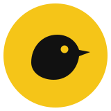

# Canary

Knowledge that knows when it's wrong.

Tectonic Hackathon 2026, SD Worx track: *"How might we turn fragmented organisational knowledge into a trusted
shared resource?"*

Demo video: *link in the Builderbase submission* · Pitch: [`presentation/`](presentation/)

## The problem

SD Worx already has **Find** (an assistant over 100,000+ internal documents) and already watches **external** law
changes (Legal Watch). The gap is between them. When the law changes, nobody knows which internal documents just
became wrong. When two documents disagree, an assistant quietly picks one. And the best answers live in the inboxes
of people like the one consultant who knows cross-border payroll.

A payroll consultant with a client on the phone does not need ten search results. They need to know **which answer
they can rely on, why, and who to call when the documents are not enough.**

## What Canary does

Canary runs over every source (policies, FAQs, wiki pages, contract templates, mails, Teams threads, tickets) and:

| | |
|---|---|
| **Detect** | Splits every source into atomic claims and compares them. It finds statements made wrong by a legal update, internal contradictions, sources for another country, documents without an owner, and knowledge that exists only in chats. |
| **Trust** | Every source gets a trust score from a visible formula (authority, review age, owner, conflicts, corroboration, legal changes). Every answer shows its status: *verified*, *unverified*, *sources disagree*, *no trusted source*. |
| **Capture** | Turns an expert's scattered chat and mail answers into a draft article for them to validate. It also spots when the right answer already sits in someone's inbox while the official document says the opposite. |
| **Connect** | When documents are not enough, it routes the question, with context, to the owner or the person who actually answers these questions. Unanswerable questions are logged as knowledge gaps. |

### Demo scenario (synthetic data)

The EU Pay Transparency Directive's transposition deadline was 7 June 2026. Canary traces that one legal change
through 17 internal sources and finds 5 statements in 3 documents that now give the wrong answer. That includes a
2023 recruitment playbook that tells recruiters to ask candidates for their current salary, which is now prohibited.
Each one goes to its owner with a suggested rewrite.

It also catches a payroll cut-off date that differs between the wiki (3rd working day) and the client help centre
(5th). The help-centre article has no owner, and a support ticket shows the conflict already delayed overtime pay for 37
employees. And it quarantines a Teams message that contains a hidden prompt injection.

All documents, people and clients in `data/corpus/` are **synthetic**, written for this demo.

## Results

<!-- RESULTS -->

## How it works

```
sources ──► security screen ──► claim extraction (LLM) ──► grounding check (code)
                 │                                              │
            quarantine                                  compare per topic (LLM + numeric check)
                                                                │
                                          deterministic rules: outdated-by-law, conflict, gap, scope
                                                                │
                                           trust scores, experts, suggested fixes ──► UI + Q&A
```

Design rule: **the model finds, code decides.**

- A claim only counts if its quote is found word for word in the source (`isGrounded`).
- Whether a contradiction means "outdated by law" or "internal conflict" is decided by rules on dates, source type
  and jurisdiction. The model does not decide it.
- After the model answers, code re-checks every citation. Outdated, quarantined or ungrounded sources are removed,
  and the status is downgraded if only informal sources remain.
- Different numbers for the same topic in the same country are flagged even if the model misses them.

## Security

Aikido audit screenshots are in the submission. Measures in the code:

- **Authentication**: per-user passwords from environment variables, constant-time comparison, HMAC-signed
  `HttpOnly` + `SameSite=Strict` session cookies with expiry and a random session id. Sessions are registered
  server-side, so logout really ends them and a copied cookie stops working. It fails closed without a strong
  `SESSION_SECRET`.
- **Authorization**: roles (consultant, owner, knowledge admin) are checked server-side. Only the owner of a document
  or an admin can approve a fix. The owner is looked up from the issue on the server, so changing an id in the
  request does not grant access (no IDOR). Live scans are admin-only and disabled unless explicitly enabled.
- **CSRF**: `SameSite=Strict` plus an `Origin` check on every state-changing request.
- **Abuse**: rate limits on login (per client and per account), questions and scans. Client IP headers are only
  trusted behind a known proxy (`TRUST_PROXY`), so spoofing them cannot dodge a limit. Input length limits, and no
  provider errors leak to the client. An owner's decision on an issue is final; only an admin can overturn it.
- **Prompt injection**: sources are screened by deterministic rules before any model sees them. Two hits means
  quarantine: the text never reaches a model and can never be cited. User questions are screened too.
- **Headers**: strict CSP, `frame-ancestors 'none'`, HSTS, nosniff, no referrer, and no `X-Powered-By`.
- **Secrets**: none in the repo. `.env.local` is git-ignored and `.env.example` documents every variable. The LLM
  key is used server-side only.
- **Dependencies**: only Next.js, React and Tailwind. No LLM SDK, just `fetch`.

## Run it

Node 24+ (scripts and tests run TypeScript directly, no build step).

```
npm install
cp .env.example .env.local   # LLM key, SESSION_SECRET and one password per persona
npm run dev                  # http://localhost:3000
npm run check                # typecheck, lint, 22 tests
npm run scan                 # rebuild data/analysis.json from data/corpus/
npm run eval                 # score scan and Q&A against data/expected.json (3 scans, 16 answers)
```

`make dev`, `make test`, `make check`, `make scan` and `make eval` do the same on macOS and Linux.

Sign in as **Ann Peeters** (payroll consultant), **Marc Dubois** (content owner) or **Sofie Claes**
(knowledge admin, can re-scan).

Any OpenAI-compatible endpoint works. We used Nebius Token Factory with `Qwen/Qwen3-235B-A22B-Instruct-2507`. The
committed `data/analysis.json` lets the app run without re-scanning.

## Layout

```
data/corpus/        17 synthetic sources (policies, FAQs, wiki, templates, mails, Teams, tickets, a legal alert)
data/expected.json  ground truth for the eval: planted problems, clean documents, Q&A cases
data/analysis.json  committed scan output the app starts from
src/canary/         engine: corpus, security, analyze, ask, auth, ratelimit, store
src/app/            Next.js UI (canary-app.tsx) and API routes (api/*)
scripts/            scan.ts, eval.ts
tests/              node:test suites: grounding, security, auth, rate limits, analysis invariants
presentation/       demo script, Q&A prep, submission text
```

## What is unfinished

- Sources are a folder of synthetic markdown files. Connectors to SharePoint, Confluence, Teams, Outlook and Zendesk
  are the obvious next step.
- At this scale every claim fits in the prompt. At 100,000+ documents, claims would go into a vector index and be
  compared per topic cluster. The rules layer stays the same.
- Sessions, approvals, gaps and resolutions are kept in memory (single instance). They need a database or Redis.
- "Send to owner" is simulated. In production it would be a Teams message or a ticket.
- Canary does not give legal advice. The Legal Watch alert in the corpus summarises directive-level obligations.
  National transposition details would come from Legal.
